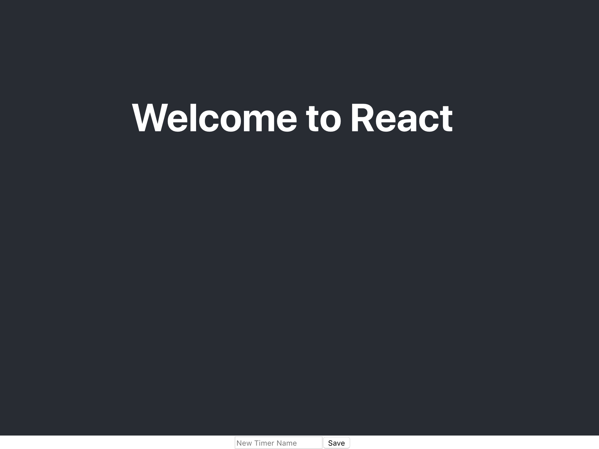

The list of timers will display all of the timers you have created.
Each timer displayed in the list will need to display the following:

- Name
- Time
- A button to start or stop that timer. The start/stop button will send messages to the dispatcher.

The Timer list itself should display the following:

- A list of timers in the store.

To access the Redux store, the timer list will need to be a container/component.

The array of timers and `selectTimer` action are passed to the component
via `props` through the `mapStateToProps` and `mapDispatchToProps` functions.

# List-Timers - Boilerplate

> [action]
>
> Create a new file `src/list-timers.js` with the following boilerplate code:
>
```js
import React, { Component } from 'react'
import { connect } from 'react-redux'
import { selectTimer } from '../actions'
>
class ListTimers extends Component {
  constructor(props) {
    super(props)
  }
>
  render() {
    return (
      <div>
       {/* render timers here */}
      </div>
    )
  }
}
>
const mapStateToProps = (state) => {
  return { timers: state.timers }
}
>
const mapDispatchToProps = () => {
  return { selectTimer }
}
>
export default connect(mapStateToProps, mapDispatchToProps())(ListTimers)
```

While this implementation doesn't render the timers, it does set up the basic elements required for container/component to interface with Redux!

# The Timer list

The timer list could be implemented as a single component. This
simple approach works but doesn't use React's Component
architecture to your advantage.

```js
render() {
    return (
      <div>
        {this.props.timers.map((timer, i) => {
         // Here the render method maps `this.props.timers` to:
          return (
            <div>
              <h2>{timer.name}</h2>
              <h1>{timer.time}</h1>
              <button>Start</button>
            </div>
          )
        })}
      </div>
    )
  }
```

This is simple, but why would we _not_ want to implement the component this way?

> [solution]
>
> To make it completely functional you will have to
add styles, possibly some more markup, the time will need to be formatted, and the button will require some logic and a click handler. What does this scream to us?
>
> **BLOAT!!**
>
> With these required additions this component would become far less manageable. In addition there would be a lot of logic, for things like formatting time, that is not core goal of this component, which is displaying a list of timers.

It's always important to break components down into smaller, more easily manageable parts as opposed to inflating them unnecessarily.

# Timer View Component

A better approach is to create a component that is responsible for displaying a single timer. Let's build this out first before we finish up the Timer List.

> [action]
>
> Create a file: `src/timer-view.js` with the following code:
>
```js
import React, { Component } from 'react'
import { connect } from 'react-redux'
>
// Import our toggleTimer action
import { toggleTimer } from '../actions'
>
class TimerView extends Component {
  constructor(props) {
    super(props)
  }
>
  // Timer should have its name, time, and a start/stop button (logic for this button will be built out later)
  render() {
>
  // Extract these specific props to use in the component
  const { index, toggleTimer, timer } = this.props
    return (
      <div>
        <h2>{timer.name}</h2>
        <h1>{timer.time}</h1>
        <button
            // This calls our toggleTimer action on the specific timer (specified by the index)
            onClick={(e) => {
                toggleTimer(index)
            }}>
            // Text of the button is determined by if the timer is running or not
            {timer.isRunning ? "Stop" : "Start"}
        </button>
      </div>
    )
  }
}
>
const mapStateToProps = (state) => {
  return {}
}
>
// Use the toggleTimer action for this component
const mapDispatchToProps = () => {
  return { toggleTimer }
}
>
export default connect(mapStateToProps, mapDispatchToProps())(TimerView)
```

Notice: `TimerView` takes a `Timer` object as a prop: `timer={timer}`. The name and time properties could then be accessed as: `this.props.timer.name` and `this.props.timer.time` within `TimerView`. However, we'll introduce a shorthand to more easily access these properties so we don't need a long string every time.

From here, the render method in `src/components/list-timers.js` can be simplified!

> [action]
>
> Update the imports and fill in the `render` method for `src/components/list-timers.js` with the following:
>
```js
import TimerView from './timer-view'
...
class ListTimers extends Component {
...
  render() {
    return (
      <div>
        {this.props.timers.map((timer, i) => <TimerView key={i} timer={timer} index={i} />)}
      </div>
    )
  }
}
```

# Putting it All Together

At this stage, we can now create timers and have them appear, as well as press a start/stop button. Let's update `App.js` to actually show our timers so we have something to look at!

> [action]
>
> Update `App.js` to import our `new-timer` and `list-timers` components and then put them in the `Provider`
>
```js
import React, { Component } from 'react';
>
import { createStore } from 'redux';
import { Provider } from 'react-redux';
>
import reducers from './reducers';
>
import logo from './logo.svg';
import './App.css';
>
[bold]import NewTimer from './components/new-timer'[/bold]
[bold]import ListTimers from './components/list-timers'[/bold]
>
const store = createStore(reducers);
>
class App extends Component {
  render() {
    return (
      <Provider store={store}>
        <div className="App">
          <header className="App-header">
            <h1 className="App-title">Welcome to React</h1>
          </header>
[bold]            <NewTimer />[/bold]
[bold]            <ListTimers />[/bold]
        </div>
      </Provider>
    );
  }
}
>
export default App;
```

Go to your browser, and you should see something like the following when you load the page. It's not pretty (we'll fix that later) but Make sure you can create a timer and that it looks like the below screenshots:

**Home Screen (tiny new timer button at the bottom)**


**Creating a new timer named "foo"**


Currently our timers won't start when we press them, but the start/stop button should still change text when you press it

> [action]
>
> Make sure your star/stop button changes text when you press it. If it doesn't go back through this chapter and make sure everything matches up. Now is a great time to practice your debugging skills!
