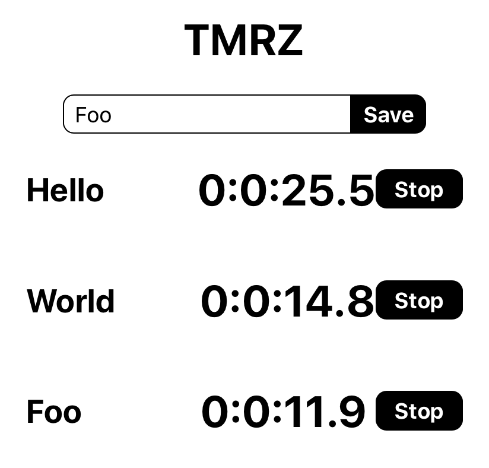

# Formatting Time

Timers can be hard for people to read if they're only displaying the time in milliseconds. Let's fix this so that they show in a proper `hour:minute:seconds.milliseconds` format:

Create a new folder in `/src` called `/utils`. Create a new file `/src/utils/index.js` and add the following time formatting function:

```js
export const formatTime = (time) => {
  const ms = Math.round(time / 100) % 10
  const secs = Math.floor(time / 1000) % 60
  const mins = Math.floor(time / 1000 / 60) % 60
  const hrs = Math.floor(time / 1000 / 1000 / 60) % 60
  return `${hrs}:${mins}:${secs}.${ms}`
}
```

Now use that function in `/src/components/TimerView.js` to display the time correctly. Remember to import the util:

Import `formatTime` at the top:

```js
import { formatTime } from '../utils';
```
Then use `formatTime` to format the time: 

```JS
...
<h1>{formatTime(timer.time)}</h1>
...
```

# Product So Far

Your timers should now look like something like the following:



Alright! We've successfully **used timing methods and objects in JavaScript to accurately track time!** And because of it, our timers now work! This is great! They still look a little ugly though, let's spruce them up a bit.

## Technical Planning

1. ~~Review Project~~
2. ~~Create timer objects~~
3. ~~Setup Redux Toolkit~~
4. ~~Setup React Redux Provider~~
5. ~~Create New Timer Component~~
6. ~~Create List Timer Component~~
7. ~~Create Timer View Component~~
8. ~~Keeping Time~~
9. **Format Time**
10. Styling the App
11. Persisting Timers

# Now Commit

```bash
$ git add .
$ git commit -m 'timer format'
$ git push
```