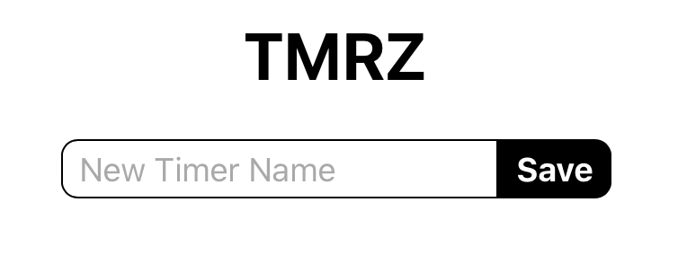
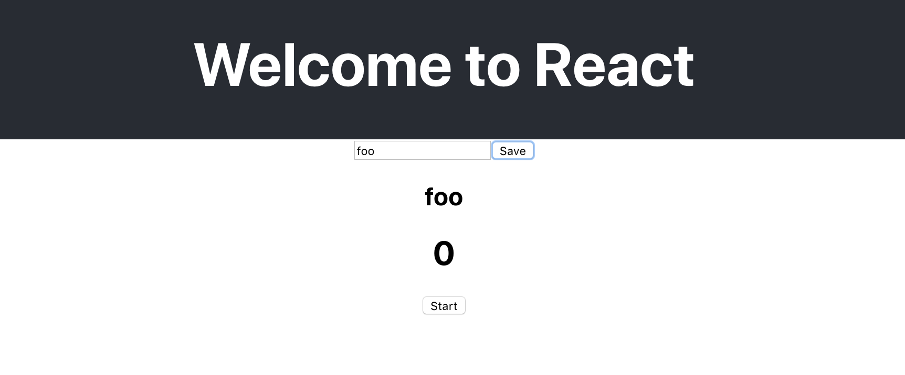

# Styling the app

A good strategy is to include a stylesheet for each component named with the same name as the component. The idea is to keep allo of the styles for that component in the stylesheet for that component. 

You can organize your components and stylesheet files in a folder named after the component. This makes it easy to look up the styles for a component and copy a component from one project to another. 

You will use this method here. 

Open `App.css` and delete all of the styles. Add these styles: 

```CSS
.App {
  display: flex;
  flex-direction: column;
  align-items: center;
  margin: 2rem;
}
```

The styles here will apply to all of the elements inside of App.js. Look there and you should see something like this: 

```JS
<div className="App">
  <NewTimer />
  <ListTimers />
</div>
```

Notice that I used the div from the default code. It has the className "App". If you don't have that add it. This is another good practice. Give the root component of every component a class name that matches the name of the component. This prevents you from accidentally using the same class name on another component and it makes it easier to think about the styles you are applying since they apply to the component they name. 

The styles here arrange NewTimer and ListTimers in a vertical column that is centered. 

Open `App.js` and import thise style sheet by adding this to the top of the page:

```JS
import './App.css';
```

With this in place the style should arrange all the children of `div.App` in a column centered in the page. 

### NewTimer Styles

Add a new CSS file `src/components/NewTimer.css`. This will hold the styles for the NewTimer component.

Make a new file: `NewTimer.css`, and add some CSS:

```CSS
.NewTimer {
	display: flex;
	justify-content: center;
}

.NewTimer > input {
	font-size: 1rem;
	padding: 0.25rem 0.5rem;
	border-radius: 0.5rem 0 0 0.5rem;
	border: 1px solid;
	margin: 0;
}

.NewTimer > button {
	font-size: 1rem;
	padding: 0.25rem 0.5rem;
	border-radius: 0 0.5rem 0.5rem 0;
	border: 1px solid #000;
	margin: 0;
	background-color: #000;
	color: #fff;
	font-weight: bold;
}
```

Notice we used the child selector (>) here. This keeps these styles scoped to the parent class name on the parent element. In this way you can guarantee that these styles will only apply to the elements in this component. 

Edit `NewTimer.js` by adding a class name: 

The NewTimer component has container with two children. Give the container element a class name that matches the component name: 

```JS
export default function NewTimer() {
	...
	return (
		<div className="NewTimer">
			...
		</div>
	)
}
```

Import the styles at the top of `NewTimer.js`

```JS
import './NewTimer.css'
```

### TimerView Styles 

Follow the same procedure for this component. Try these steps on your own:

1. Make a new CSS filed after the component
2. Import the styles in the component 
3. Assign a class name to the root element of the component with the same name
4. Add some styles to the stylesheet

The TimerView component has a three child elements: Name, Time, and Start/Stop button. Let's arrange these in a row with the time in the center and the other elements at either end of the row. 

Open `TimerView.js` and add a class name on the root element. 

```js
export default function TimerView(props) {
  ...
  return (
    <div className="TimerView">
      ...
    </div>
  )
}
```

Make a new CSS file: `TimerView.css`

```CSS
.TimerView {
	width: 320px;
	display: flex;
	flex-direction: row;
	justify-content: space-between;
	align-items: baseline;
}

.TimerView > h1 {
	flex:1;
	margin: 1rem;
	text-align: left;
	font-variant-numeric: tabular-nums;
}

.TimerView > h2 {
	flex: 1;
}

.TimerView > button {
	padding: 0.25rem 0.5rem;
	border-radius: 0.5rem;
	border: 1px solid #000;
	background-color: #000;
	color: #fff;
	font-size: 1rem;
	font-weight: bold;
	width: 4rem;
}
```

Here you styled each of the three children: h1, h2, and button of the parent `div.TimerView`. 

Import your style sheet at the top of `TimerView.js`

```JS
import './TimerView.css'
```

# Product So far

Now go to your browser, and you should see something like the following when you load the page. It's not pretty (we'll fix that later) but Make sure you can create a timer and that it looks like the below screenshots:

**Home Screen (tiny new timer button at the bottom)**


**Creating a new timer named "foo"**


## Technical Planning

1. ~~Review Project~~
2. ~~Create timer objects~~
3. ~~Setup Redux Toolkit~~
4. ~~Setup React Redux Provider~~
5. ~~Create New Timer Component~~
6. ~~Create List Timer Component~~
7. ~~Create Timer View Component~~
8. ~~Keeping Time~~
9. ~~Format Time~~
10. **Styling the App**
11. Persisting Timers

# Now Commit

```bash
$ git add .
$ git commit -m 'Styled Timers'
$ git push
```